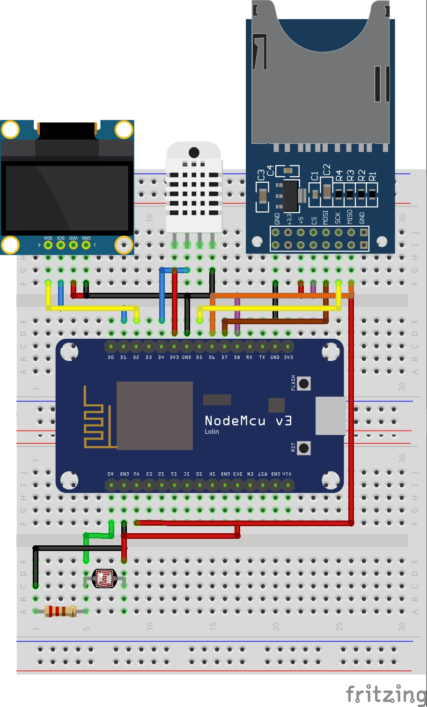

# Weather Station ESP8266

# Overview
The repository includes everything needed to build an Weather Station ESP8266 (including hardware information, PCB Design, and footprint):

# What do I Need To Make One?
In this project, we assume that we still need to debug and see the output in serial monitor. So we need :
- Arduino IDE (the lastest version recommended) with serial monitor in PC or Laptop

Other Essential Things :
- Standar USB to Micro USB cable
- ESP-12E Development Board ESP8266 NodeMCU ([Pict](https://raw.githubusercontent.com/wirahitaputramas/Weather-Station-ESP8266-PT-INTI-Internship/master/images/ESP%2012E%20Development%20Board.jpg "ESP-12E Development Board ESP8266 NodeMCU"))
- OLED I2C Display 128x64 Pixel ([Pict](https://raw.githubusercontent.com/wirahitaputramas/Weather-Station-ESP8266-PT-INTI-Internship/master/images/OLED%20I2C%20Display.jpg "OLED I2C Display 128x64 Pixel"))
- SPI MicroSD Module ([Pict](https://raw.githubusercontent.com/wirahitaputramas/Weather-Station-ESP8266-PT-INTI-Internship/master/images/MicroSD%20Modul.jpg "MicroSD Module"))
- MicroSD Card (SDHC Under 32 GB recommended)
- DHT22 Modue ([Pict](https://raw.githubusercontent.com/wirahitaputramas/Weather-Station-ESP8266-PT-INTI-Internship/master/images/DHT22%20Module.jpgg "DHT22 Module"))
- LDR Photoresistor
- SMD Resistor 5 kohm

# How to Make One ?

## 1. Prototype design on breadboard (Fritzing)
Before we make the circuit on the PCB, we must ensure that we choose the correct GPIO. Because of that, first of all we must hookup all component on breadboard like this picture below :

  

Here is the raw fritzing file ([Pict](https://github.com/wirahitaputramas/Weather-Station-ESP8266-PT-INTI-Internship/blob/master/Weather%20Station%20ESP8266%20on%20Breadboard.fzz "Weather Station ESP8266 on Breadboard"))

Here the connection of each pin (exclude Vcc & GND) :
- D1 or GPIO5 to OLED SCL
- D2 or GPIO4 to OLED SDA
- D4 or GPIO2 to DHT22 IO (Data)
- D5 or GPIO14 to microSD SCLK
- D6 or GPIO12 to microSD MISO
- D7 or GPIO13 to microSD MOSI
- D8 or GPIO15 to microSD CS
- A0 or ADC0 to LDR Photoresistor

## 2. Testing each component separately

## 3. Hookup prototype on breadboard

## 4. Coding The Whole System

## 5. Testing whole prototype on breadboard

## 6. PCB design (KiCad)

## 7. Hookup & Run on PCB
